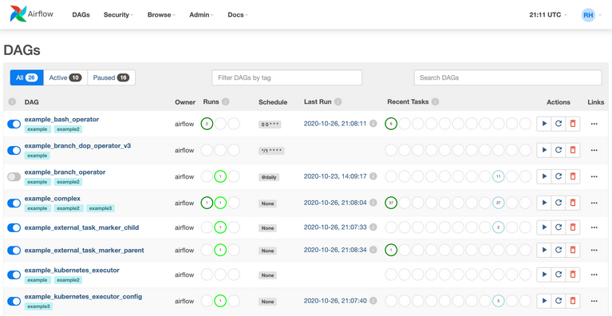
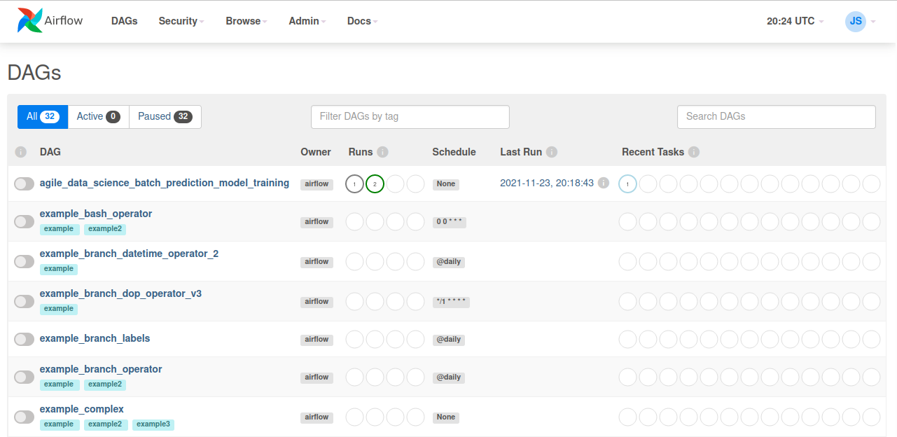

# Flight Predictor
## Scenario 1: Run components Zookeeper, Kafka, MongoDB, Spark Streaming and Flask independently

# Installation
It's necessary to install the following components:

 - [Intellij](https://www.jetbrains.com/help/idea/installation-guide.html) (jdk_1.8)
 - [Pyhton3](https://realpython.com/installing-python/) (Suggested version 3.7) 
 - [PIP](https://pip.pypa.io/en/stable/installing/)
 - [SBT](https://www.scala-sbt.org/release/docs/Setup.html) 
 - [MongoDB](https://docs.mongodb.com/manual/installation/)
 - [Spark](https://spark.apache.org/docs/latest/) (Mandatory version 3.1.2)
 - [Scala](https://www.scala-lang.org)(Suggested version 2.12)
 - [Zookeeper](https://zookeeper.apache.org/releases.html)
 - [Kafka](https://kafka.apache.org/quickstart) (Mandatory version kafka_2.12-3.0.0)

### Install python libraries
 
 ```
  pip install -r requirements.txt
 ```
 ### Start Zookeeper
 
 Open a console and go to the downloaded Kafka directory and run:
 
 ```
   bin/zookeeper-server-start.sh config/zookeeper.properties
  ```
  ### Start Kafka
  
  Open a console and go to the downloaded Kafka directory and run:
  
  ```
    bin/kafka-server-start.sh config/server.properties
   ```
   open a new console in teh same directory and create a new topic :
  ```
      bin/kafka-topics.sh \
        --create \
        --bootstrap-server localhost:9092 \
        --replication-factor 1 \
        --partitions 1 \
        --topic flight_delay_classification_request
   ```
   You should see the following message:
  ```
    Created topic "flight_delay_classification_request".
  ```
  You can see the topic we created with the list topics command:
  ```
      bin/kafka-topics.sh --bootstrap-server localhost:9092 --list
  ```
  Output:
  ```
    flight_delay_classification_request
  ```
  (Optional) You can oen a new console with a consumer in order to see the messeges sent to that topic
  ```
  bin/kafka-console-consumer.sh \
      --bootstrap-server localhost:9092 \
      --topic flight_delay_classification_request \
      --from-beginning
  ```
  ## Import the distance records to MongoDB
  Check if you have Mongo up and running:
  ```
  service mongod status
  ```
  Output:
  ```
  mongod.service - MongoDB Database Server
     Loaded: loaded (/lib/systemd/system/mongod.service; disabled; vendor preset: 
     Active: active (running) since Tue 2019-10-01 14:58:53 CEST; 2h 11min ago
       Docs: https://docs.mongodb.org/manual
   Main PID: 7816 (mongod)
     CGroup: /system.slice/mongod.service
             └─7816 /usr/bin/mongod --config /etc/mongod.conf
  
  oct 01 14:58:53 amunoz systemd[1]: Started MongoDB Database Server.
  ```
  Run the import_distances.sh script. **If MongoDB version is 5 or higher it's necessary to change "ensureIndex" to "createIndex" in the script.**
  ```
  ./resources/import_distances.sh
  ```
  Output:
  ```
  2019-10-01T17:06:46.957+0200	connected to: mongodb://localhost/
  2019-10-01T17:06:47.035+0200	4696 document(s) imported successfully. 0 document(s) failed to import.
  MongoDB shell version v4.2.0
  connecting to: mongodb://127.0.0.1:27017/agile_data_science?compressors=disabled&gssapiServiceName=mongodb
  Implicit session: session { "id" : UUID("9bda4bb6-5727-4e91-8855-71db2b818232") }
  MongoDB server version: 4.2.0
  {
  	"createdCollectionAutomatically" : false,
  	"numIndexesBefore" : 1,
  	"numIndexesAfter" : 2,
  	"ok" : 1
  }

  ```
  ## Train and save the model with PySpark mllib
  In a console go to the base directory of the cloned repo, then go to the `practica_big_data_2019` directory
  ```
    cd practica_big_data_2019
  ```
  Set the `JAVA_HOME` env variable with teh path of java installation directory, for example:
  ```
    export JAVA_HOME=/usr/lib/jvm/java-1.8.0-openjdk-amd64/bin
  ```
  Set the `SPARK_HOME` env variable with teh path of your Spark installation folder, for example:
  ```
    export SPARK_HOME=/opt/spark
  ```
  Now, execute the script `train_spark_mllib_model.py`
  ```
      python3 resources/train_spark_mllib_model.py .
  ```
  As result, some files will be saved in the `models` folder 
  
  ```
  ls ../models
  
  ```   
  ## Run Flight Predictor
  First, you need to change the base_paht val in the MakePrediction scala class,
  change that val for the path where you clone repo is placed:
  ```
    val base_path= "/home/user/Desktop/practica_big_data_2019"
    
  ``` 
  Then run the code using Intellij or spark-submit with their respective arguments. 
  
Please, note that in order to use spark-submit you first need to compile the code and build a JAR file using sbt. To compile and package the code open a terminal in the "flight_prediction" folder and run:
 ```
  sbt compile package
     
  ``` 
The .jar file will be generated in "flight_prediction/target/scala-2.12/" folder. Take into account that, when running the spark-submit command, you have to add at least these two packages with the --packages option:
  ```
  spark-submit --packages org.mongodb.spark:mongo-spark-connector_2.12:3.0.1,org.apache.spark:spark-sql-kafka-0-10_2.12:3.1.2 ./<generated_package>.jar
     
  ``` 
   Be carefull with the packages version because if you are using another version of spark, kafka or mongo you have to choose the correspondent version to your installation. This packages work with Spark 2.4.0, kafka_2.12-2.3.0 and mongo superior to 2.6.
  
  ## Start the prediction request Web Application
  
  - Set the `PROJECT_HOME` env variable with teh path of you cloned repository, for example:
   ```
  export PROJECT_HOME=/home/user/Desktop/practica_big_data_2019
   ```
  - Activate the python virtual environment
  
In scenario_1 run:
```
source env/bin/activate
```
- Run the prediction script

Go to the `web` directory under `resources` and execute the flask web application file `predict_flask.py`:
  ```
  cd practica_big_data_2019/resources/web
  python3 predict_flask.py
  
  ```
  Now, visit http://localhost:5000/flights/delays/predict_kafka and, for fun, open the JavaScript console. Enter a nonzero departure delay, an ISO-formatted date (I used 2016-12-25, which was in the future at the time I was writing this), a valid carrier code (use AA or DL if you don’t know one), an origin and destination (my favorite is ATL → SFO), and a valid flight number (e.g., 1519), and hit Submit. Watch the debug output in the JavaScript console as the client polls for data from the response endpoint at /flights/delays/predict/classify_realtime/response/.
  
  ## Check the predictions records inserted in MongoDB
  ```
   $ mongo
   > use agile_data_science;
   >db.flight_delay_classification_response.find();
  
  ```
  You must have a similar output as:
  
  ```
  { "_id" : ObjectId("5d8dcb105e8b5622696d6f2e"), "Origin" : "ATL", "DayOfWeek" : 6, "DayOfYear" : 360, "DayOfMonth" : 25, "Dest" : "SFO", "DepDelay" : 290, "Timestamp" : ISODate("2019-09-27T08:40:48.175Z"), "FlightDate" : ISODate("2016-12-24T23:00:00Z"), "Carrier" : "AA", "UUID" : "8e90da7e-63f5-45f9-8f3d-7d948120e5a2", "Distance" : 2139, "Route" : "ATL-SFO", "Prediction" : 3 }
  { "_id" : ObjectId("5d8dcba85e8b562d1d0f9cb8"), "Origin" : "ATL", "DayOfWeek" : 6, "DayOfYear" : 360, "DayOfMonth" : 25, "Dest" : "SFO", "DepDelay" : 291, "Timestamp" : ISODate("2019-09-27T08:43:20.222Z"), "FlightDate" : ISODate("2016-12-24T23:00:00Z"), "Carrier" : "AA", "UUID" : "d3e44ea5-d42c-4874-b5f7-e8a62b006176", "Distance" : 2139, "Route" : "ATL-SFO", "Prediction" : 3 }
  { "_id" : ObjectId("5d8dcbe05e8b562d1d0f9cba"), "Origin" : "ATL", "DayOfWeek" : 6, "DayOfYear" : 360, "DayOfMonth" : 25, "Dest" : "SFO", "DepDelay" : 5, "Timestamp" : ISODate("2019-09-27T08:44:16.432Z"), "FlightDate" : ISODate("2016-12-24T23:00:00Z"), "Carrier" : "AA", "UUID" : "a153dfb1-172d-4232-819c-8f3687af8600", "Distance" : 2139, "Route" : "ATL-SFO", "Prediction" : 1 }


```
## Scenario 2: Flight Predictor improvements
In "scenario_2", the folders "Spark" and "Flask" are included. The original code of both components has been modified to insert some improvements. 
- Spark

As for Spark, the MakePrediction.scala file (located in "Build" along with the modified build.sbt) now uses environment variables to define the Kafka bootstrap servers and the MongoDB server address and port number. Besides, the environment variable `SEND_PREDICTION_TO` has been added to allow Spark to send the predictions to a Kafka topic instead of to MongoDB. This removes the need of the web app to be constantly polling MongoDB until it gets a prediction. Now, the web app acts as a consumer of the Kafka topic `flight_prediction_response`, when a prediction is written to the topic, it shows it on screen. In "Spark" there is also a Dockerfile and the necessary files to build an image.
The environment variables `MONGODB_HOST`, `MONGODB_PORT`, `BOOTSTRAP_SERVERS` (if more than one separate them with commas) and `SEND_PREDICTION_TO` need to be set when running the container. If `SEND_PREDICTION_TO` is set to "mongo", the predictions will be sent to MongoDB, otherwise they will be written to the topic.
- Flask (Web App)

The file flight_predict.py in /code/resources/web also uses now environment variables to define the Kafka bootstrap servers and the MongoDB server address and port number. Furthermore, a `RETRIEVE_PREDICTION_FROM` has been introduced to indicate whether the prediction is retrieved from MongoDB or the Kafka topic `flight_prediction_response`. The configuration between `RETRIEVE_PREDICTION_FROM` and `SEND_PREDICTION_TO` in Spark needs to be coherent: both must be set to "mongo" or "kafka" in order for the application to work correctly.
A new file mongo_seed.py has been created to seed the Mongo database with the distance records when the web app starts. After it starts, it also executes the create_topic.py script, which creates the topics `flight_delay_classification_request` and `flight_prediction_response` if they don't exist.

**When running the Flask container, it is mandatory that the environment variable `TOPIC_NAME` includes at least flight_delay_classification_request,flight_prediction_response topics.** More topics can be added (separated with commas), the Flask app will create them (if don't exist) on startup. **There must be a one-to-one correspondence between each topic in `TOPIC_NAME` and each value in `TOPIC_PARTITIONS` and `TOPIC_REPLICATION`.**

### Start Flight Predictor (Predictions sent to MongoDB)

To start the Flight Predictor using docker compose enter the following command:
```
docker-compose -f flight_predictor.yml up
```
A Spark master and two workers made up the Spark cluster.
### Start Flight Predictor (Predictions written to Kafka)

To start the Flight Predictor using docker compose enter the following command:
```
docker-compose -f flight_predictor_kafka_pred_resp.yml up
```
A Spark master and two workers made up the Spark cluster. They send the predictions to the Kafka topic and the web app retrieves them. To see the predictions being written to the topic `flight_prediction_response`, another Kafka consumer can be used. After accessing the Kafka container run the following command:
```
/bin/kafka-console-consumer \
    --bootstrap-server localhost:9092 \
    --topic flight_prediction_response \
    --from-beginning
```
Visit [http://localhost:9999/flights/delays/predict_kafka](http://localhost:9999/flights/delays/predict_kafka) to use the application.

## Scenario 3: Deploy Flight Predictor using Kubernetes and Minikube
- Install Minikube using a Docker container or virtual machine using [https://minikube.sigs.k8s.io/docs/start/](https://minikube.sigs.k8s.io/docs/start/). A minimum of 5 GB of RAM is recommended for the VM. Once installed start the container or VM.
- Open a terminal and start minikube to be able to use kubectl:
```
minikube start --vm-driver=virtualbox
```
In this case the virtualization hypervisor used is Virtualbox. If another one is used, the vm-driver flag has to be set accordingly.
- Deploy Kafka and Zookeeper

To deploy Kafka and Zookeeper, a [Bitnami Helm chart](https://artifacthub.io/packages/helm/bitnami/kafka) is used. It is important to notice that it provides the DNS name `my-release-kafka-0.my-release-kafka-headless.default.svc.cluster.local` with port `9092` to connect to the Kafka cluster from within the Kubernetes cluster. 
To add the Kafka repository use the following command:
```
helm repo add bitnami https://charts.bitnami.com/bitnami
```
To install the chart:
```
helm install my-release bitnami/kafka
```
- Deploy MondoDB

To deploy Kafka and Zookeeper, a [Bitnami Helm chart](https://artifacthub.io/packages/helm/bitnami/mongodb) is used. It is important to notice that it provides the DNS name `mongodb-dev.default.svc.cluster.local` with port `27017` to connect to the Kafka cluster from within the Kubernetes cluster. 
To add the MongoDB repository use the following command:
```
helm repo add bitnami https://charts.bitnami.com/bitnami (if you haven't previously done)
```
To install the chart:
```
helm install mongodb-dev bitnami/mongodb --set auth.enabled=false
```
- Deploy Spark

The files spark-deployment.yaml and spark-service.yaml are provided in "scenario_3" to create the components necessary for Spark. It's important to note the environment variable configuration.

To deploy Spark:
```
kubectl apply -f spark-deployment.yaml
```
To deploy the Spark service:
```
kubectl apply -f spark-service.yaml
```
- Deploy Flask

The files flask-deployment.yaml and flask-service.yaml are provided in "scenario_3" to start the Flask service.

To deploy Flask:
```
kubectl apply -f flask-deployment.yaml
```
To deploy the Flask service:
```
kubectl apply -f flask-service.yaml
```
The Flask service is external, it provides access to the Flask app through the nodePort 30005.
- Make Minikube assign an external IP to the Flask service

List running services and take the Flask service:
```
kubectl get services
```
Use the following command to make Minikube assign an external IP to the Flask service:
```
minikube service <flask_service>
```
Visit [http://localhost:30005/flights/delays/predict_kafka](http://localhost:30005/flights/delays/predict_kafka) to use the application.
## Apache Airflow architecture
Airflow is a platform that allows to build and run workflows. A workflow is represented as a DAG (a Directed Acyclic Graph), and contains individual pieces of work called Tasks, arranged with dependencies and data flows taken into account. 
A DAG specifies the dependencies between Tasks, and the order in which to execute them and run retries; the Tasks themselves describe what to do, be it fetching data, running analysis, triggering other systems, or more.

An Airflow installation generally consists of the following components:
- A scheduler, which handles both triggering scheduled workflows, and submitting Tasks to the executor to run.
- An executor, which handles running tasks. In the default Airflow installation, this runs everything inside the scheduler, but most production-suitable executors actually push task execution out to workers.
- A webserver, which presents a handy user interface to inspect, trigger and debug the behaviour of DAGs and tasks.
- A folder of DAG files, read by the scheduler and executor (and any workers the executor has).
- A metadata database, used by the scheduler, executor and webserver to store state.
Workloads

### Workloads
A DAG runs through a series of Tasks, and there are three common types of tasks:
- Operators, predefined tasks that you can string together quickly to build most parts of your DAGs.
- Sensors, a special subclass of Operators which are entirely about waiting for an external event to happen.
- A TaskFlow-decorated @task, which is a custom Python function packaged up as a Task.

DAGs are designed to be run many times, and multiple runs of them can happen in parallel. DAGs are parameterized, always including an interval they are “running for” (the data interval), but with other optional parameters as well.
Tasks have dependencies declared on each other. You’ll see this in a DAG either using the >> and << operators:
```
first_task >> [second_task, third_task]
third_task << fourth_task
```
Or, with the set_upstream and set_downstream methods:
```
first_task.set_downstream([second_task, third_task])
third_task.set_upstream(fourth_task)
```
Both syntax forms mean the same: the second and third tasks depend on first task, and the fourth task depends on the third task.
### User interface
Airflow comes with a user interface that allows to see what DAGs and their tasks are doing, trigger runs of DAGs, view logs, and do some limited debugging and resolution of problems with the DAGs.
[](test)

## Analysis of agile_data_science_batch_prediction_model_training DAG definition
To define a DAG a DAG definition file is used. As can be seen in setup.py, a DAG definition file is roughly composed of five main parts:
- Importing modules
```
import sys, os, re

from airflow import DAG
from airflow.operators.bash import BashOperator

from datetime import datetime, timedelta
import iso8601

PROJECT_HOME = os.getenv("PROJECT_HOME")
```
The necessary modules of airflow are imported, as well as the `PROJECT_HOME` environment variable that is used to indicate the directory where the extracted features are located.
- Default arguments
```
default_args = {
  'owner': 'airflow',
  'depends_on_past': False,
  'start_date': iso8601.parse_date("2016-12-01"),
  'retries': 3,
  'retry_delay': timedelta(minutes=5),
}
```
A dictionary of default parameters is defined which is passed to the tasks when they are created. The `retries` field indicates the number of retries that should be performed before failing the task, i.e, according to the setup.py configuration, it will attempt to execute the task 3 times before considering it failed. The `retry_delay` field sets the time between retries to 5 minutes.
- DAG instantiation
```
training_dag = DAG(
  'agile_data_science_batch_prediction_model_training',
  default_args=default_args,
  schedule_interval=None
)
```
A DAG object is needed in order to nest the tasks into. The string "agile_data_science_batch_prediction_model_training" is the `dag_id`  which serves as a unique identifier for the DAG. The default_args dictionary created before is passed to the constructor. The `schedule_interval` field is used to define how often that DAG runs, in this case it is set to None, indicating the DAG will be only run manually.
- Tasks definition
```
pyspark_bash_command = """
spark-submit --master {{ params.master }} \
  {{ params.base_path }}/{{ params.filename }} \
  {{ params.base_path }}
"""
```
Airflow leverages the power of Jinja Templating and provides the pipeline author with a set of built-in parameters and macros. These are the commands executed when the task runs, it has placeholders that are filled up when the tasks are defined.
```
train_classifier_model_operator = BashOperator(
  task_id = "pyspark_train_classifier_model",
  bash_command = pyspark_bash_command,
  params = {
    "master": "local[8]",
    "filename": "resources/train_spark_mllib_model.py",
    "base_path": "{}/".format(PROJECT_HOME)
  },
  dag=training_dag
)
```
The field `task_id` is used to identify each task within a DAG and `bash_command` indicates the command the task executes, which is the one defined previously. `params` is used to fill up the arguments of the bash command with Jinja. The train_spark_mllib_model.py script is executed to train the model based on the extracted features; the output folder is /models.
- Setting up dependencies

Dependencies can be established among tasks as has been previously explained. In this case, as the only required task is `pyspark_train_classifier_model`, there is no need to declare dependencies.
# Train the prediction model using Airflow
- Download "scenario_1", install python packages requirements in scenario_1 and the one in /resources/airflow:
```
cd scenario_1
pip install -r requirements.txt

cd scenario_1/resources/airflow
pip install -r requirements.txt -c constraints.txt

```
- Set the `PROJECT_HOME` env variable with the path of you cloned repository, for example:
```
export PROJECT_HOME=/home/user/Desktop/scenario_1
```
- Initialize the database tables
```
airflow db init
```
- Configure airflow environment

```shell
export AIRFLOW_HOME=~/airflow
mkdir $AIRFLOW_HOME/dags
mkdir $AIRFLOW_HOME/logs
mkdir $AIRFLOW_HOME/plugins

airflow users create \
    --username admin \
    --firstname Jack \
    --lastname  Sparrow\
    --role Admin \
    --email example@mail.org
```
- Make DAG visible to Airflow 

In /resources/airflow there is setup.py file that defines the DAG and prediction task. The default location for the DAGs is ~/airflow/dags, but more generally it is $AIRFLOW_HOME/dags. Copy setup.py to $AIRFLOW_HOME/dags (or set a symlink).
- Make sure that the pipeline is parsed successfully
```
python $AIRFLOW_HOME/dags/setup.py
```
- Check that Airflow can see the DAG
```
airflow dags list
```
- List tasks within agile_data_science_batch_prediction_model_training dag
```
airflow tasks list agile_data_science_batch_prediction_model_training
```
In this case there's only one task: pyspark_train_classifier_model.
- Test the task using the CLI
```
airflow tasks test agile_data_science_batch_prediction_model_training pyspark_train_classifier_model 2021-11-23
```
The trained model files should be generated in the "models" folder.
- Start airflow scheduler and webserver
```shell
airflow webserver --port 8080
airflow scheduler
```
Vistit http://localhost:8080/home for the web version of Apache Airflow. It must be somewhat similar to the following image:
[](test)
